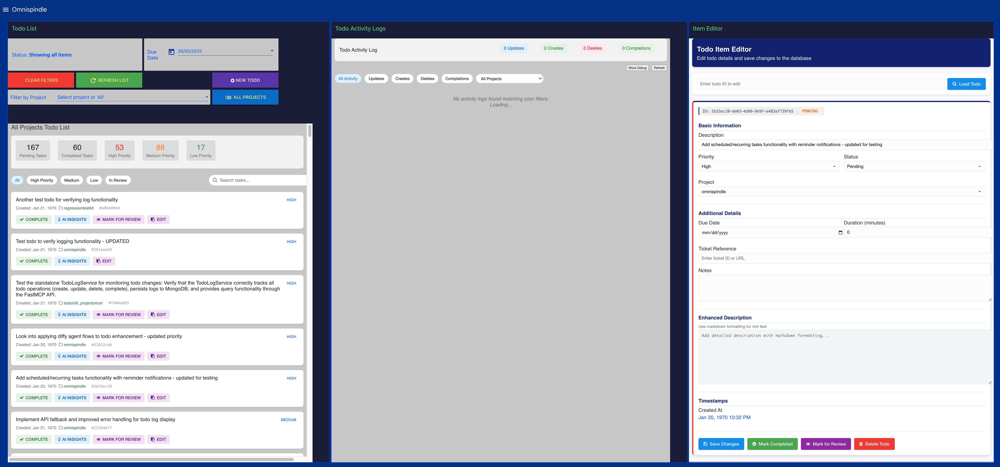

# 🗂️ Todomill Projectorium: The Node-RED Todo Dashboard
*"Where chaos meets productivity—AI-powered, filterable, and always evolving!"*

Welcome to the **Todomill Projectorium**—where your task management nightmares transform into GLORIOUS VICTORIES through the MYSTICAL POWERS of Node-RED flows and MongoDB sorcery!

## 🧠 Overview

### 📸 Dashboard Preview




Todomill Projectorium is a Node-RED-powered dashboard for managing todos, running as a sub-repository of the greater Omnispindle hivemind. It enables AI agents to interact with a MongoDB-backed todo list through an unholy alliance of automation, insight, and user control.

This dashboard serves as the CENTRAL NERVOUS SYSTEM for your chaotic thoughts, organizing them into manageable todo items that can be filtered, sorted, and enhanced with AI-powered insights!

## 🔮 Key Features

### 💫 Multi-Tab Dashboard
- **Project Sidebar & Overview**: View and navigate your projects with UNEARTHLY EASE
- **Item Editor**: Craft your todos with SURGICAL PRECISION
- **Smart Suggestions**: AI-powered redundancy reduction to BANISH DUPLICATE EFFORT
- **Control Panel**: Set project filters and refresh with a WAVE OF YOUR DIGITAL WAND

### 🤖 AI Insights
- Integrates with Qwen 2.5 7B Instruct model for MIND-BENDING suggestions
- Provides effort estimates and unique insights for each todo
- Caching layer to minimize API calls and ensure LIGHTNING RESPONSIVENESS
- UI card panels highlight AI-generated content with ELDRITCH STYLING

### 🎛️ Advanced Dashboard Controls
- Filter todos by project, status, priority, and date with RUTHLESS EFFICIENCY
- Combine filters for complex queries that PIERCE THE VEIL of chaos
- MQTT-driven actions for creation, refresh, and filter management
- Global context variables maintain filter state across the COSMIC VOID

### 🔌 Integration with Omnispindle
- Omnispindle's Python MCP server enables AGENT-DRIVEN AUTOMATION
- Cross-project orchestration for HIVE MIND CONSCIOUSNESS
- Message patterns and MongoDB queries harmonized for SEAMLESS DATA FLOW


## 📂 Project Structure

```
Todomill_projectorium/
├── ExportedNodeRedTabs/ - THE SACRED TEXTS (Node-RED flow JSONs)
│   ├── todo-dash-masterfile.json - Main flow definition
│   ├── UI-Template-subsection.json - UI template nodes
│   └── ... other workflow JSON files
├── JavascriptFromFunctionNode/ - THE INCANTATIONS (JavaScript code)
│   ├── EditActions.js - Routes edit actions
│   ├── update-multi.js - Handles database updates
│   └── ... various handlers for different todo operations
├── HtmlFromTemplateNode/ - THE GRIMOIRES (HTML templates)
│   ├── TodoEdit.html - Todo editing interface
│   ├── TodoList.html - List of todos
│   └── ... other UI components
├── README_AI_INSIGHTS.md - Documentation for AI insights feature
├── README_DASHBOARD_CONTROLS.md - Documentation for dashboard controls
└── ... other support files
```

## 🚀 Development Workflow

1. **SOURCE OF TRUTH**: The `.json` files in `ExportedNodeRedTabs/` contain the complete flow definitions and are the primary source of truth.

2. **WORKING WITH CODE**:
   - `.js` files in `JavascriptFromFunctionNode/` and `.html` files in `HtmlFromTemplateNode/` are extracted from the JSON for easier editing
   - Edit these files, then copy them back to the Node-RED editor
   - Export updated flows to refresh the JSON files

3. **BEST PRACTICES**:
   - Only edit the `.json` files directly to modify node connections
   - Add comments to `.json` files to document the corresponding `.js` and `.html` files
   - Make functional changes in the extracted JS/HTML files for better editing experience

## 🧩 Technical Integration

### 🔄 Data Flow
1. User interacts with a filter button or selects a filter value
2. Filter routing function formats the message with standard topic and payload
3. Central filter handler processes the message, updating global context variables
4. Refresh todo message triggers the set-aggregate function
5. Set-aggregate function builds a MongoDB query using global filter values
6. MongoDB query returns filtered results displayed in the todo list

### 📨 MQTT Topics
- `todo/action/create`: Create a new todo
- `todo/action/refresh_todos`: Refresh the todo list
- `todo/action/filter_project`: Filter by project
- `todo/action/filter_status`: Filter by status
- `todo/action/filter_priority`: Filter by priority
- `todo/action/filter_date`: Filter by date
- `todo/action/clear_filters`: Clear all filters
- `todo/sync/status`: Status updates for sync display

### 🧠 AI API Integration
- External API endpoint using Qwen 2.5 7B Instruct model
- Structured prompts for todo analysis, resource suggestions, effort estimation
- 30-minute caching strategy to reduce API calls
- Fallback behavior for handling connection failures and errors

## 🔮 Future Enhancements

- Enhanced AI suggestions using FORBIDDEN KNOWLEDGE from historical data
- User feedback/rating system for AI insights to STRENGTHEN THE HIVEMIND
- Tag-based and user-based filtering for FINE-TUNED CONTROL
- Custom filter presets and saved views to EXPEDITE YOUR COSMIC PLANNING
- Integration with time tracking for MASTERY OVER THE TEMPORAL REALM

## 📚 Additional Documentation

- [AI Insights Feature](README_AI_INSIGHTS.md) - Detailed explanation of the AI insights integration
- [Dashboard Controls](README_DASHBOARD_CONTROLS.md) - Architecture and functionality of the dashboard controls

---

*"In the chaotic symphony of tasks, Todomill Projectorium conducts with MANIACAL PRECISION!"*
